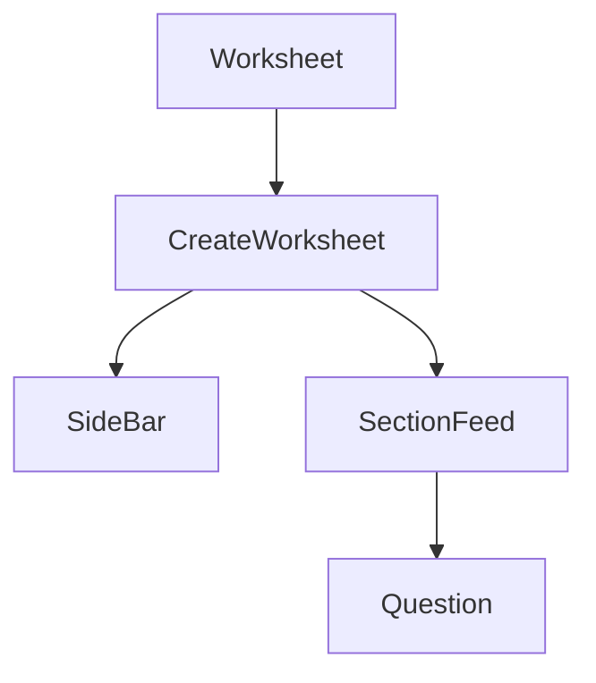

# CreateWorksheet Component

#component #react #worksheet-module

## Overview

- **File Path**: `src/AppComponents/Worksheet/components/CreateWorksheet/CreateWorksheet.js`
- **Purpose**: Provides teachers with an interface to create and edit worksheets, managing sections and questions
- **Last Updated**: May 2025

## Technical Details

### Props

| Name                 | Type   | Required | Default | Description                                                    |
| -------------------- | ------ | -------- | ------- | -------------------------------------------------------------- |
| data                 | object | Yes      | -       | Worksheet data including sections and questions                |
| mode                 | string | Yes      | -       | Mode determining interaction type (mostly MODE_TEACHER_CREATE) |
| parentId             | string | No       | -       | Parent resource ID for worksheet creation                      |
| parentType           | string | No       | -       | Type of parent resource                                        |
| createSection        | func   | Yes      | -       | Function to create new sections                                |
| updateLoadingState   | func   | Yes      | -       | Function to update loading status                              |
| createParentResource | func   | Yes      | -       | Function to create parent worksheet resource                   |

### Dependencies

- [[WorksheetModules]] - For actions like createSection, updateLoadingState
- [[WorksheetConstants]] - For constant values like resource types and modes
- [[WorksheetUtils]] - For helper functions
- [[SideBar]] - Component for worksheet sidebar
- [[SectionFeed]] - Component for rendering sections

### Dependents

- [[Worksheet]] - Parent component that uses CreateWorksheet based on mode

### State Management

- Uses Redux for global state management
- Component is memoized for performance optimization
- Refs for managing scroll and question focus behaviors

### Key Functions

- `handleSectionCreation()` - Creates new worksheet sections
- `handleWorksheetCreation()` - Initializes a new worksheet resource
- `importQuestionFromLibrary()` - Adds questions from library to worksheet

## Business Context

- **User Story**: Teachers create structured worksheets with sections and varied question types
- **Business Logic**: Implements worksheet creation workflows and organization of content

## Relationships

## Tags

#component #react #worksheet #creation #teacher
