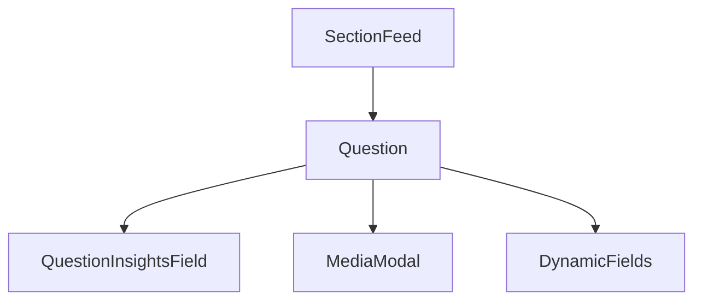

# Question Component

#component #react #worksheet-module

## Overview

- **File Path**: `src/AppComponents/Worksheet/components/Question/Question.js`
- **Purpose**: Renders individual questions within worksheet sections, supporting different question types and interaction modes
- **Last Updated**: May 2025

## Technical Details

### Props

| Name           | Type   | Required | Default | Description                                                       |
| -------------- | ------ | -------- | ------- | ----------------------------------------------------------------- |
| question       | object | Yes      | -       | Question data object with fields, type and content                |
| mode           | string | Yes      | -       | Mode determining question interaction (create, attempt, evaluate) |
| sectionId      | string | Yes      | -       | ID of the parent section                                          |
| updateQuestion | func   | No       | -       | Function to update question data                                  |
| onDelete       | func   | No       | -       | Function to delete the question                                   |
| isLastQuestion | bool   | No       | false   | Whether this is the last question in the section                  |

### Dependencies

- [[WorksheetUtils]] - For question-related utility functions
- [[MediaModal]] - For handling media attachments
- [[QuestionInsightsField]] - For displaying question analytics
- [[DropdownMenu]] - UI component for question options menu
- [[Tooltip]] - UI component for tooltips

### Dependents

- [[SectionFeed]] - Uses Question components to render question lists
- [[QuestionDetailsSideBar]] - Uses Question data for sidebar details

### State Management

- Local state using React hooks (useState)
- Debounced callbacks for performance optimization
- Connected to Redux via connect() for global state access

### Key Functions

- `handleQuestionUpdate()` - Handles updates to question fields
- `handleToolOrderUpdate()` - Manages order of assessment tools
- `handleAttachmentUpload()` - Processes file attachments
- `renderQuestionField()` - Renders different field types based on question structure

## Business Context

- **User Story**: Teachers create varied question types while students interact with questions based on their configuration
- **Business Logic**: Implements different question types (text, multiple choice, etc.), validation rules, and scoring logic

## Relationships

## Tags

#component #react #worksheet #question #assessment
