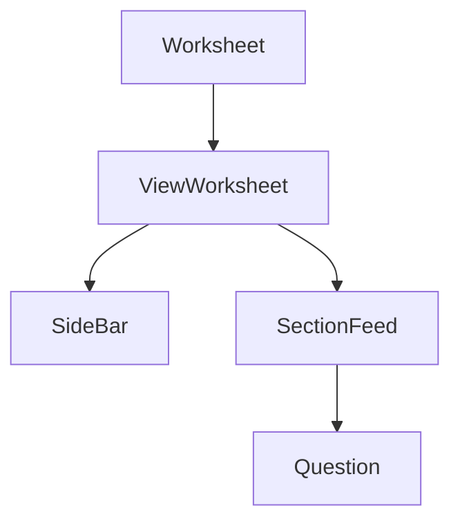

# ViewWorksheet Component

#component #react #worksheet-module

## Overview

- **File Path**: `src/AppComponents/Worksheet/components/ViewWorksheet/ViewWorksheet.js`
- **Purpose**: Displays worksheet content in read-only mode, primarily for review purposes
- **Last Updated**: May 2025

## Technical Details

### Props

| Name                     | Type   | Required | Default | Description                                                         |
| ------------------------ | ------ | -------- | ------- | ------------------------------------------------------------------- |
| mode                     | string | Yes      | -       | View mode (MODE_ASSESSMENT_VIEW or MODE_RESTRICTED_ASSESSMENT_VIEW) |
| data                     | object | Yes      | -       | Worksheet data including sections and questions                     |
| setWorksheetContainerRef | func   | No       | -       | Function to set worksheet container reference                       |
| setScrollContainerRef    | func   | No       | -       | Function to set scroll container reference                          |
| isFromLibrary            | bool   | No       | false   | Whether viewing from question library                               |
| isToddleLibraryPortal    | bool   | No       | false   | Whether viewing in Toddle Library portal                            |

### Dependencies

- [[WorksheetUtils]] - For helper functions like getSideBarOptions
- [[WorksheetConstants]] - For view mode constants
- [[SideBar]] - Component for worksheet sidebar
- [[SectionFeed]] - Component for rendering sections
- [[ACLStore]] - For permission checking

### Dependents

- [[Worksheet]] - Parent component that uses ViewWorksheet based on mode

### State Management

- Uses React hooks for local state (hideAnswers)
- Component uses conditional rendering based on permissions and mode

### Key Functions

- `handleToggleHideAnswers()` - Toggles visibility of answer content
- `renderWorksheetContent()` - Renders the worksheet content based on mode

## Business Context

- **User Story**: Users (teachers/students) view worksheet content in read-only format
- **Business Logic**: Controls visibility of answers based on user role and settings

## Relationships

## Tags

#component #react #worksheet #view #assessment
