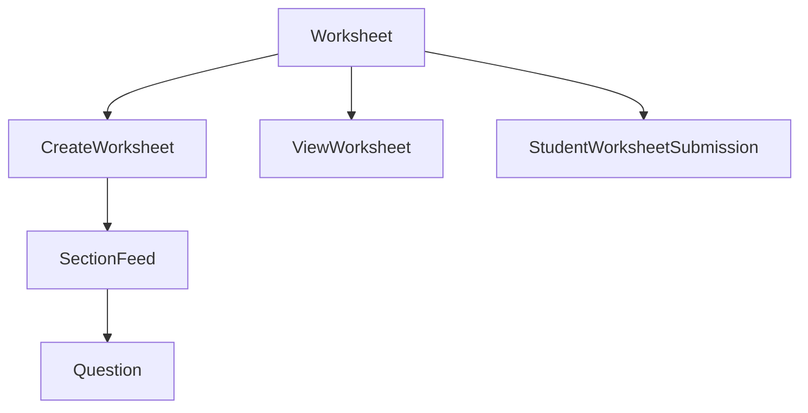

# Worksheet Component

#component #react #worksheet-module #root-component

## Overview

- **File Path**: `src/AppComponents/Worksheet/Worksheet.js`
- **Purpose**: Root component for the Worksheet module that handles different modes of worksheet interaction (teacher creation, student attempt, evaluation, etc.)
- **Last Updated**: May 2025

## Technical Details

### Props

| Name         | Type   | Required | Default | Description                                                                 |
| ------------ | ------ | -------- | ------- | --------------------------------------------------------------------------- |
| mode         | string | Yes      | -       | Determines the worksheet display mode (teacher view, student attempt, etc.) |
| data         | object | Yes      | -       | Contains worksheet information including sections and questions             |
| parentId     | string | No       | -       | Parent resource ID for worksheet creation                                   |
| parentType   | string | No       | -       | Type of parent resource                                                     |
| assignmentId | string | No       | -       | Related assignment ID                                                       |

### Dependencies

- [[WorksheetUtils]] - Utility functions for worksheets
- [[WorksheetModules]] - State management for worksheets
- [[WorksheetConstants]] - Constant values used across the module
- [[SideBar]] - Component for worksheet sidebar
- [[FullScreenLoader]] - Loading indicator component

### Dependents

- Various routes and containers that incorporate worksheets

### State Management

- Uses Redux for global state management
- Apollo Client for GraphQL data fetching
- PureComponent for performance optimization

### Key Functions

- `handleWorksheetSubmit()` - Handles worksheet submission
- `handleSectionCreation()` - Creates new worksheet sections
- `handleQuestionCreation()` - Creates new questions within sections

## Business Context

- **User Story**: Teachers can create, preview, and evaluate worksheets while students can attempt, view and receive evaluation feedback
- **Business Logic**: Implements permission-based access control, submission workflows, and evaluation rules

## Relationships

## Tags

#component #react #worksheet #root-component #assessment
