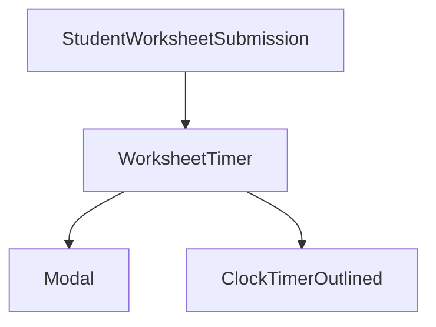

# WorksheetTimer Component

#component #react #worksheet-module

## Overview

- **File Path**: `src/AppComponents/Worksheet/components/WorksheetTimer/WorksheetTimer.js`
- **Purpose**: Manages timing functionality for timed worksheet assignments, including countdown display and auto-submission
- **Last Updated**: May 2025

## Technical Details

### Props

| Name                   | Type   | Required | Default | Description                                                |
| ---------------------- | ------ | -------- | ------- | ---------------------------------------------------------- |
| startEvent             | object | Yes      | -       | Event marking when the worksheet attempt started           |
| isTestEnded            | bool   | No       | false   | Whether the test period has ended                          |
| isTestStarted          | bool   | No       | false   | Whether the test period has started                        |
| timedTestDuration      | number | No       | 0       | Duration of the test in minutes                            |
| worksheetTitle         | string | No       | -       | Title of the worksheet                                     |
| onSubmitTimedWorksheet | func   | No       | -       | Function to handle worksheet submission on time expiration |
| isSafeBrowserEnabled   | bool   | No       | false   | Whether the worksheet requires safe exam browser           |

### Dependencies

- [[DateTimeHelpers]] - For time formatting and calculations
- [[WorksheetUtils]] - For safe exam browser navigation
- [[WorksheetModules]] - For updating auto-submit state
- [[Modal]] - UI component for timer warning modals
- [[Button]] - UI component for action buttons

### Dependents

- [[StudentWorksheetSubmission]] - Uses the timer for student attempt mode
- [[Worksheet]] - May incorporate timer based on worksheet configuration

### State Management

- Uses React hooks for timer state management
- useRef for interval references to prevent memory leaks
- Connected to Redux for global state actions

### Key Functions

- `startTimer()` - Initializes and starts the countdown
- `formatTime()` - Formats remaining time for display
- `checkAndShowWarning()` - Shows warning dialog when time is almost up
- `handleAutoSubmit()` - Processes automatic submission when time expires

## Business Context

- **User Story**: Students have a clear view of remaining time for timed assessments with warnings and auto-submission
- **Business Logic**: Enforces time limits on assessments, handles submission on expiry, and provides visual feedback

## Relationships

## Tags

#component #react #worksheet #timer #assessment #student
