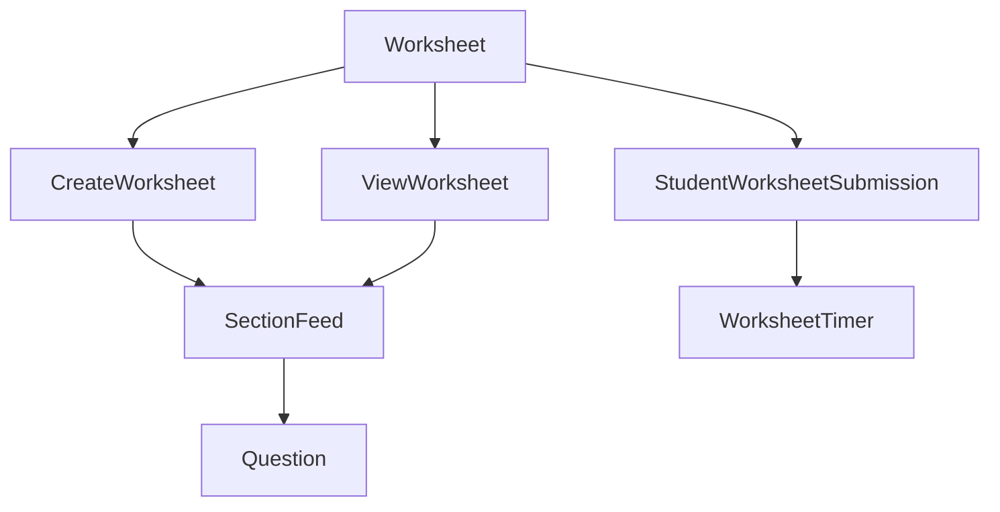

# Worksheet Module Components

#module #worksheet #index

This is an index of all documented components in the Worksheet module.

## Core Components

- [[Worksheet]] - Root component for the Worksheet module
- [[CreateWorksheet]] - Interface for creating and editing worksheets
- [[ViewWorksheet]] - Read-only display for worksheet content
- [[Question]] - Renders individual questions within sections
- [[WorksheetTimer]] - Manages timed worksheet assignments

## Component Relationships

## Module Structure

The Worksheet module is organized with the following key parts:

1. **Core Components** - Main UI components for different worksheet modes
2. **Helper Components** - Specialized components for specific features
3. **GraphQL Integration** - Queries, mutations, and fragments for data operations
4. **State Management** - Redux actions, reducers, and selectors
5. **Utilities** - Helper functions and business logic

## Business Workflows

- Worksheet Creation - Teachers creating structured question sheets
- Student Attempt - Students answering questions and submitting responses
- Evaluation - Teachers reviewing and scoring student submissions
- Analytics - Viewing performance data and question insights

## Tags

#worksheet-module #index #component-list
